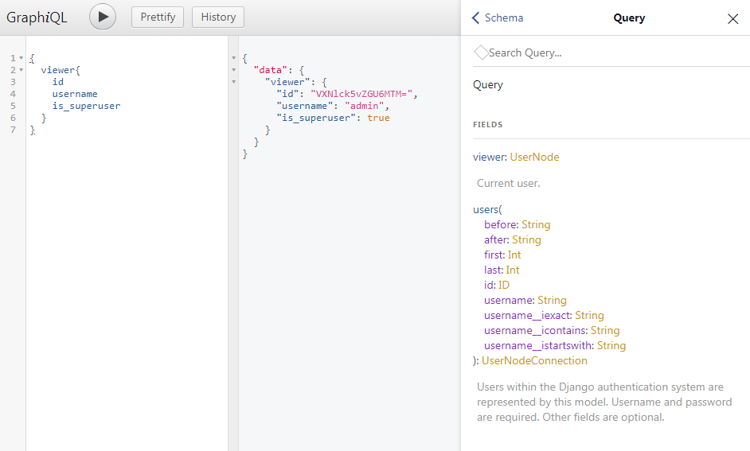
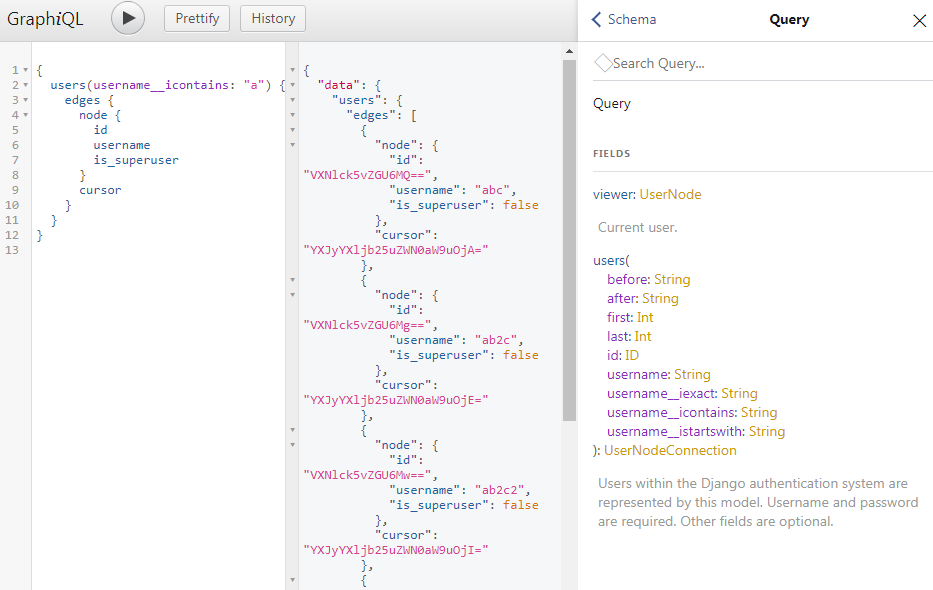
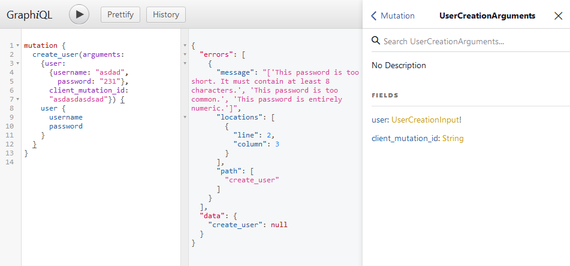
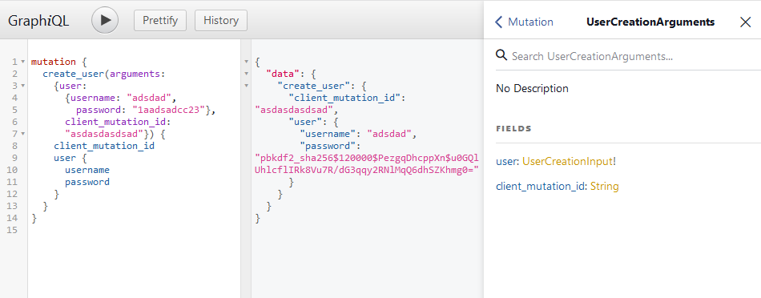
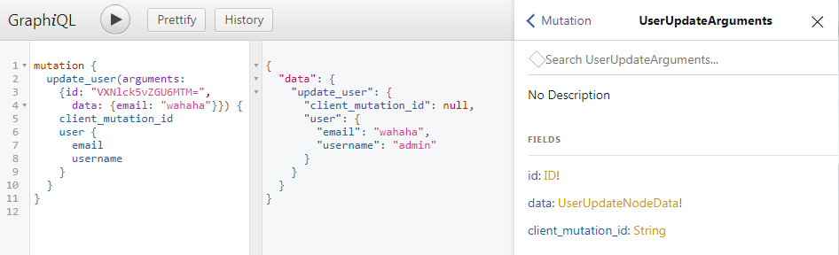

# Graphene django tools

[](https://github.com/NateScarlet/graphene-django-tools/actions)
[](https://pypi.org/project/graphene-django-tools/)


Tools for use [`graphene-django`](https://github.com/graphql-python/graphene-django)

## Install

`pip install graphene-django-tools`

## Features

### Resolver

Using mongoose-like schema to write apollo-like resolver.

simple example:

```python
import graphene
import graphene_django_tools as gdtools

class Foo(gdtools.Resolver):
    schema = {
        "args": {
            "key":  'String!',
            "value": 'String!',
        },
        "type": 'String!',
    }

    def resolve(self, **kwargs):
        self.parent # parent field
        self.info # resolve info
        self.context # django request object
        return kwargs['value']

class Query(graphene.ObjectType):
    foo = Foo.as_field()
```

```graphql
{
  foo(key: "k", value: "v")
}
```

```json
{ "foo": "v" }
```

relay node:

```python
class Pet(gdtools.Resolver):
    schema = {
        'type': {
            'name': models.Pet._meta.get_field('name'),
            'age': models.Pet._meta.get_field('age'),
        },
        'interfaces': (graphene.Node,)
    }

    def get_node(self, id_):
        return models.Pet.objects.get(pk=id_)

    def validate(self, value):
        return isinstance(value, models.Pet)

class Query(graphene.ObjectType):
    node = graphene.Node.Field()

schema = graphene.Schema(query=Query, types=[Pet.as_type()])
```

```graphql
{
  node(id: "UGV0OjE=") {
    id
    __typename
    ... on Pet {
      name
      age
    }
  }
}
```

```json
{ "node": { "id": "UGV0OjE=", "__typename": "Pet", "name": "pet1", "age": 1 } }
```

relay connection:

```python
class Item(gdtools.Resolver):
    schema = {'name': 'String!'}

class Items(gdtools.Resolver):
    schema = gdtools.get_connection(Item)

    def resolve(self, **kwargs):
        return gdtools.resolve_connection([{'name': 'a'}, {'name': 'b'}], **kwargs)
```

```graphql
{
  items {
    edges {
      node {
        name
      }
      cursor
    }
    pageInfo {
      total
      hasNextPage
      hasPreviousPage
      startCursor
      endCursor
    }
  }
}
```

```json
{
  "items": {
    "edges": [
      { "node": { "name": "a" }, "cursor": "YXJyYXljb25uZWN0aW9uOjA=" },
      { "node": { "name": "b" }, "cursor": "YXJyYXljb25uZWN0aW9uOjE=" }
    ],
    "pageInfo": {
      "total": 2,
      "hasNextPage": false,
      "hasPreviousPage": false,
      "startCursor": "YXJyYXljb25uZWN0aW9uOjA=",
      "endCursor": "YXJyYXljb25uZWN0aW9uOjE="
    }
  }
}
```

complicated example:

```python
class Foo(gdtools.Resolver):
    _input_schema = {
        "type": {"type": 'String'},
        "data": [
            {
                "type":
                {
                    "key": {
                        "type": 'String',
                        "required": True,
                        "description": "<description>",
                    },
                    "value": 'Int',
                    "extra": {
                        "type": ['String!'],
                        "deprecation_reason": "<deprecated>"
                    },
                },
                "required": True
            },
        ],
    }
    schema = {
        "args": {
            "input": _input_schema
        },
        "type": _input_schema,
        "description": "description",
        "deprecation_reason": None
    }

    def resolve(self, **kwargs):
        return kwargs['input']
```

```graphql
{
  foo(
    input: { type: "type", data: [{ key: "key", value: 42, extra: ["extra"] }] }
  ) {
    type
    data {
      key
      value
      extra
    }
  }
}
```

```json
{
  "foo": {
    "type": "type",
    "data": [{ "key": "key", "value": 42, "extra": ["extra"] }]
  }
}
```

### Query

- `ModelField`
- `ModelConnectionField`
- `ModelFilterConnectionField`

[example schema](./demo/api/schema.py)

Map the user model with filter in 10 lines.




### Mutation

- `ModelMutation`
- `ModelCreateMutation`
- `ModelUpdateMutation`

example: [`graphene_django_tools.auth` module](./graphene_django_tools/auth.py)

Map the user model with password validation in 40 lines.





### Re-implemented `Mutation` class

Supports arguments on interface.

```python
class ClientMutationID(graphene.Interface):
    """Mutation with a client mutation id.  """

    class Arguments:
        client_mutation_id = graphene.String()

    client_mutation_id = graphene.String()
```

### Data loader integrate

Enable by add `'graphene_django_tools.dataloader.middleware.DataLoaderMiddleware'` to your django settings `GRAPHENE['MIDDLEWARE']`

## Development

run dev server: `make dev`

test: `make test`
